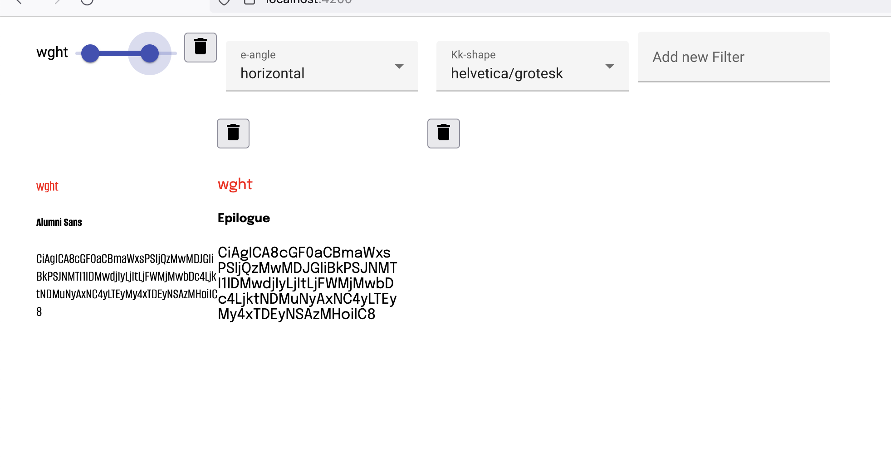
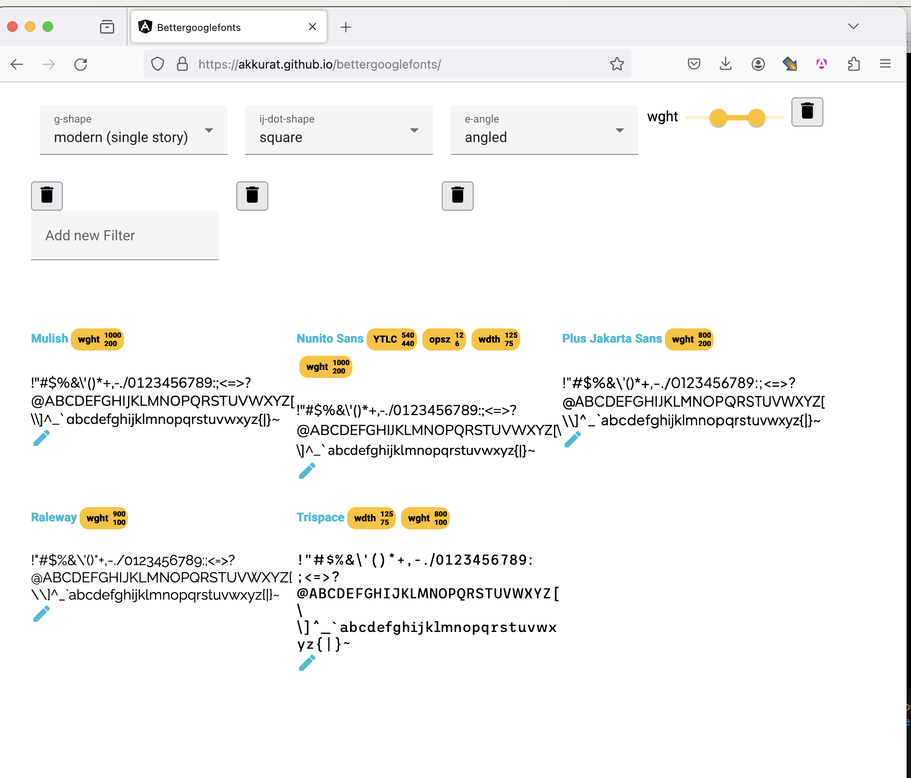

# Better Google Fonts





# How to Run
## Github Pages
Go to (https://akkurat.github.io/bettergooglefonts/)

### Classification

In the overview click on the pencil icon for any font, e.g. (https://akkurat.github.io/bettergooglefonts/classify/ABeeZee)

* Click on "Import to Local Storage" -> This copies the current state of classifications
* Start classifying
* Next / Previous font only consider SANS fonts at the moment as the classification has only a few properties for serif fonts (e.g. M stems / tip, W tip). However the direct URL is working
* Publishing the classifications:
  * go to (https://akkurat.github.io/bettergooglefonts/classify-json) 
  * clone/fork this repo or edit only
  * copy the contents into ```bettergooglefontsng/src/assets/classification.json```
  * make pull request
  * since the classifications once done won't change to much there is no intend to change the process to anything more sophisticated than a plain json. not relying on a backend means being able to publish it on github and not to worry about any db storage

## Local Installation

```bash
git clone https://github.com/akkurat/bettergooglefonts.git
```

Cloning the submodule is only necessary for creating a new woff2-subset or updating meta infos

```bash
git clone --recurse-submodules https://github.com/akkurat/bettergooglefonts.git
```

(submodule will take it's time as it is >1GB to clone)


## combine all meta font data into one fat json
Installation is needed for protobuf parser
```bash
npm i
node gf.js bettergooglefontsng/assets/
```

## start angular app to serve font files and overview
```bash
cd bettergooglefontsng
npm i
ng serve
```

# Roadmap
## Bugish
* Alignment of filters: Some sort of grouping the delete buttons with the filters would be helpful


## Reasonable TODOs
* number of fonts with this filter (trivial, lazyloading is only in dom, in js the array is already complete, just display ```.length```)
* Checkbox to in- or exclude fonts without the respective axis availabe
* Map standard axis to discrete values (e.g. weight, width, slant/ italic angle)
* Detailview of font with something like this [https://www.axis-praxis.org/specimens/__DEFAULT__] -> Quickwin: Link to google fonts for now
* Custom specimen text -> Sofar only Ascii letters possible (due to subset woff) -> load ttf from github raw?
  * Loading ttf from github raw is already done for classification view
  * First step however should be custom ascii preview text
* Grid/List view
* Size / Width/ Weight Waterfall
  * Size waterfall is trivial
  * Iterating through all axes (or discrete fonts) is a bit more complicated but also manageable
* Bigger View of font (or letter maybe?) upon hovering
* Show classifications in overview

## Fancy Todos
(not necessarily harder to implement, but lower prio)
* Show number filtered Fonts due to Range or Selection Filter
* [Sankey Diagram](https://en.wikipedia.org/wiki/Sankey_diagram) for filtering path
* [Venn Diagram](https://en.wikipedia.org/wiki/Venn_diagram) for font properties (e.g. which fonts have a helvetica like K, double story g and and are real italics)
* Questionaire: Characterizations for Serif fonts


# Limitations
* Size matters: All ttf fonts originally are 1.7 GB. Subsetting them for only ASCII and converting to woff2 results in a reasonable 60MB in total
* Preview for a specific font is now going to the original google page. The font tester is actually quite ok. 

# Structure

## Data consolidation
### Sources of Information
* FONTMETA.pb: Axes Information, Font Styles, Filepath of the font
* axisregistry: Metainfos on Axis (not yet used in GUI but .pb files are parsed)
* tags/all/families.csv: Tagging Info more detailed than just serif / sans (not yet used)
* classification.json

### Offline computing
* All FONTMETA.pb files (protobuf files) are parse by the nodescript gf.js and wrote into ```bettergooglefontsng/src/assets/fontmeta.json``` (parameter of the script)
* All *.pb files in the axisregistry/data are merged into ```bettergooglefontsng/src/assets/axismeta.json```
* classification.json is copied from 'http://localhost:4200/classify-json' 
* converting ttf fonts to woff2 with only ascii for the preview: ```glyphhanger --subset="fonts/**/*.ttf" --output=gf-subsets/ascii_us --US_ASCII --formats=woff2```

### App 
* At startup an in-memory minimongo db is setup with the contents of fontmeta.json and classification.json merged together
* Afterwards filtering is done via mongo queries

### Questionnaire
* To classify a font use (http://localhost:4200/classify/paprika)
* The answers are written into localstorage
* To contribute classifications go to http://localhost:4200/classify-json and copy the contents into classification.json

## Angular App
* mongofont.service.ts -> Has the meta data
* fontoverview -> listing fonts, main routing
* fontpreview -> One tile in the listing
* fontfilters -> upper part of fontoverview
* classifier -> questionnaire
